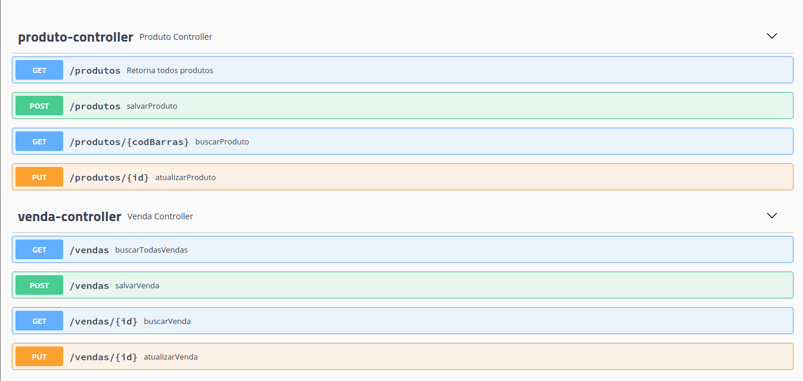

[![LinkedIn][linkedin-shield]][linkedin-url]

<hr>

<br />
<p align="center">
  <a href="https://github.com/ghisiluizgustavo/market-control">
    
  </a>

<h3 align="center">Market Control</h3>

  <p align="center">
    Uma simples API CRUD para controle de estoque
    <br />
    
  </p>
</p>

<hr>

##📋 Sobre

Uma API com funções CRUD, no ramo de mercado / mercearia / pequena loja.




###🖥️ Tecnologias e ferramentas utilizadas

* [Java 11](https://www.oracle.com/br/java/technologies/javase-jdk11-downloads.html)
* [Maven](https://maven.apache.org/)
* [MySQL](https://www.mysql.com/downloads/)
* [Spring](https://spring.io/)
* [IntelliJ](https://www.jetbrains.com/pt-br/idea/)
* [Postman](https://www.postman.com/)


##🐾 Getting Started

Para rodar a aplicação localmente você precisa seguir os seguintes passos... 

### 💾 Instalação

1. Clone o repositório
   ```sh
   git clone https://github.com/ghisiluizgustavo/market-control.git
   ```
2. Vá até o diretório do projeto ( *backend* ) e rode
   ```sh
   mvn clean install
   ```
3. Abra o projeto na IDE de sua preferência

<hr>


[linkedin-shield]: https://img.shields.io/badge/-LinkedIn-black.svg?style=for-the-badge&logo=linkedin&colorB=555
[linkedin-url]: https://www.linkedin.com/in/luiz-gustavo-ghisi-flores-88bb61171/
